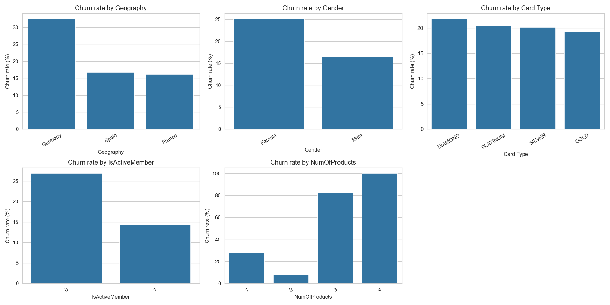
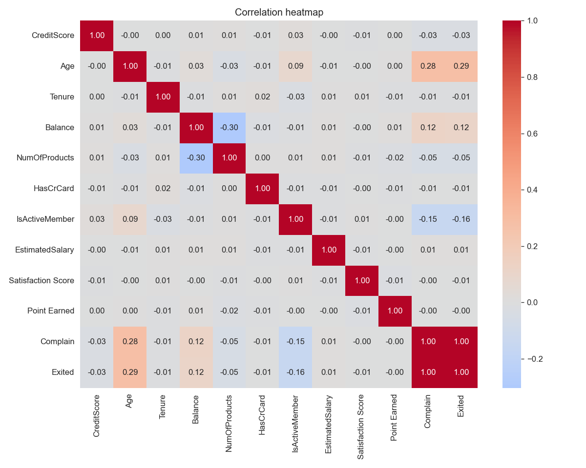
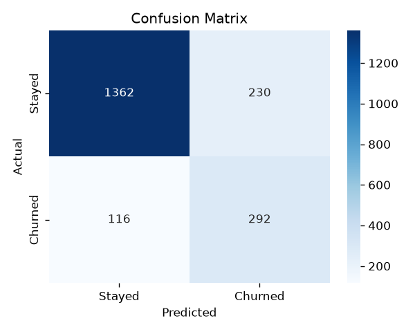

# Customer Churn Prediction Pipeline

An end-to-end machine learning project that predicts the probability a
bank customer will churn, so a retention team can proactively target
at-risk customers with offers — before they leave, not after.

Built as a full ML engineering exercise: data validation, EDA, feature
engineering, model comparison, hyperparameter tuning, unit tests, and a
deployed interactive dashboard.

---
🚀 [Live Demo](https://your-demo-link.com)
---

## Results Summary

**Model:** Random Forest (tuned via `GridSearchCV`, 3-fold CV, scored on ROC-AUC)
**Best parameters:** `max_depth=10`, `min_samples_leaf=5`, `n_estimators=200`

| Metric | Score |
|---|---|
| Accuracy | 0.840 |
| Precision | 0.591 |
| Recall | 0.691 |
| F1 | 0.637 |
| **ROC-AUC** | **0.872** |

Random Forest was compared against Logistic Regression (ROC-AUC 0.792)
and a Decision Tree (ROC-AUC 0.680) before being selected and tuned.
Full comparison logic: [`src/train.py`](src/train.py).

**Why Recall over Precision here:** for a churn model, missing an
actual churner is usually more costly to the business than one
unnecessary retention offer — so the model favors catching more true
churners (Recall 0.69) even at the cost of some false alarms
(Precision 0.59). This is a business trade-off, not a fixed rule; the
decision threshold can be adjusted depending on retention campaign
budget.

### What actually drives churn (from the trained model)

| Feature | Importance |
|---|---|
| Age | 0.221 |
| Number of Products | 0.180 |
| Age Group: 46-60 | 0.106 |
| Balance | 0.066 |
| Estimated Salary | 0.050 |

Consistent with EDA: older customers, and customers in the 46-60
bracket specifically, churn more; Germany-based customers and inactive
members also show elevated churn rates. Full breakdown in
[`notebooks/02_eda.ipynb`](notebooks/02_eda.ipynb).

### A key data quality decision: `Complain`

The raw data included a `Complain` field that matched the churn label
on **99.86%** of rows — a near-certain sign of **data leakage** (the
value was likely recorded at/after the churn event, not before it). It
was deliberately excluded from the feature set rather than used for a
misleadingly high accuracy score. Full reasoning documented in
[`notebooks/03_feature_engineering.ipynb`](notebooks/03_feature_engineering.ipynb)
and [`reports/data_dictionary.md`](reports/data_dictionary.md).

---

## Key Visualizations

**Churn rate by customer segment:**


**Correlation heatmap** (note `Complain`'s near-1.0 correlation with the target — the leakage signal, visually confirmed):


**Final model — confusion matrix on held-out test data:**


---

## App Screenshots

_Add screenshots here after running the app locally:_

```bash
streamlit run app/streamlit_app.py
```

Suggested: save screenshots into a `screenshots/` folder and reference
them below, e.g.:

```markdown


```

---

## Project Structure

```
Customer-Churn-Capstone/
├── data/
│   ├── raw/                       # Original CSV (not committed to git)
│   └── processed/                 # Engineered features, ready for modeling
├── notebooks/
│   ├── 01_data_understanding.ipynb
│   ├── 02_eda.ipynb
│   ├── 03_feature_engineering.ipynb
│   └── 04_model_training.ipynb
├── src/
│   ├── preprocessing.py           # Load + validate raw data
│   ├── features.py                # Feature engineering (reusable)
│   ├── train.py                   # Train, compare, tune, save model
│   ├── evaluate.py                # Full evaluation report
│   └── predict.py                 # Score a single new customer
├── tests/
│   ├── test_train.py
│   ├── test_predict.py
│   └── conftest.py
├── models/                        # Saved model + scaler (not committed)
├── reports/
│   ├── data_dictionary.md
│   ├── Model_Report.txt
│   └── figures/                   # Saved charts
├── app/
│   └── streamlit_app.py           # Interactive dashboard
├── requirements.txt
├── .gitignore
└── README.md
```

---

## Setup

```bash
# 1. Clone the repo
git clone https://github.com/<your-username>/Customer-Churn-Capstone.git
cd Customer-Churn-Capstone

# 2. Create and activate a virtual environment
python -m venv venv
source venv/bin/activate        # Windows: venv\Scripts\activate

# 3. Install dependencies
pip install -r requirements.txt

# 4. Add the raw dataset
# Place Customer-Churn-Records.csv into data/raw/
```

## Running the Pipeline

```bash
cd src

# Validate and inspect the raw data
python preprocessing.py

# Engineer features (saves data/processed/featured_data.csv)
python features.py

# Train, compare, tune, and save the model
python train.py

# Generate the full evaluation report
python evaluate.py

# Score a single sample customer
python predict.py
```

Or step through the reasoning interactively in `notebooks/`, in order
(01 → 04) — the notebooks document *why* each decision was made; `src/`
holds the same logic as clean, reusable, tested functions.

## Running the Tests

```bash
# from the project root
pytest tests/ -v
```

## Running the Dashboard

```bash
streamlit run app/streamlit_app.py
```

---

## Tech Stack

- **Data:** pandas, NumPy
- **Visualization:** Matplotlib, Seaborn, Plotly
- **Modeling:** scikit-learn (Logistic Regression, Decision Tree, Random Forest), XGBoost (optional)
- **Testing:** pytest
- **App:** Streamlit
- **Serialization:** joblib

## Dataset

Source: [Kaggle - Bank Customer Churn (extended)](https://www.kaggle.com/datasets/radheshyamkollipara/bank-customer-churn),
10,000 rows, 18 columns. See [`reports/data_dictionary.md`](reports/data_dictionary.md)
for full column documentation.

## Possible Next Steps

- Add SHAP for per-customer explainability (why *this specific*
  customer scored high, not just global feature importance)
- Wrap `predict.py` in a FastAPI endpoint for programmatic access
  alongside the Streamlit UI
- Replace the hand-rolled `get_dummies` + column-alignment logic in
  `features.py`/`predict.py` with a scikit-learn `ColumnTransformer` +
  `OneHotEncoder(handle_unknown="ignore")` pipeline — more robust and
  the more typical production pattern
- Add a GitHub Actions workflow to run `pytest` on every push
